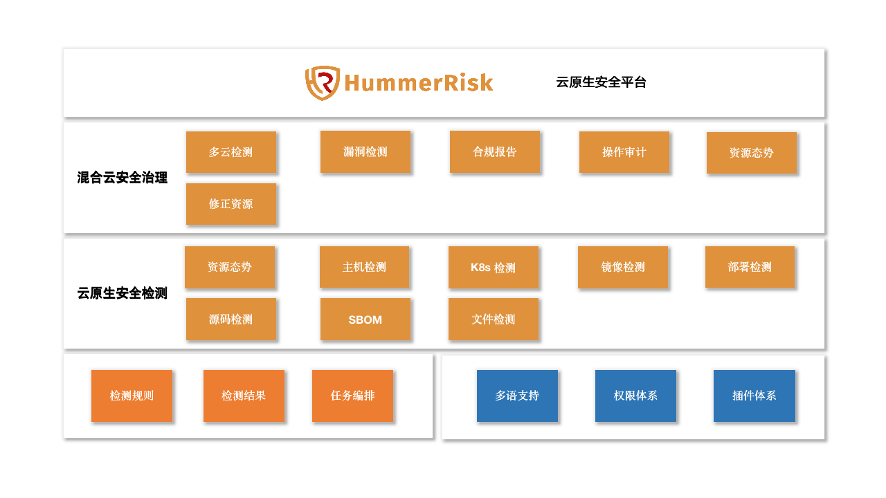
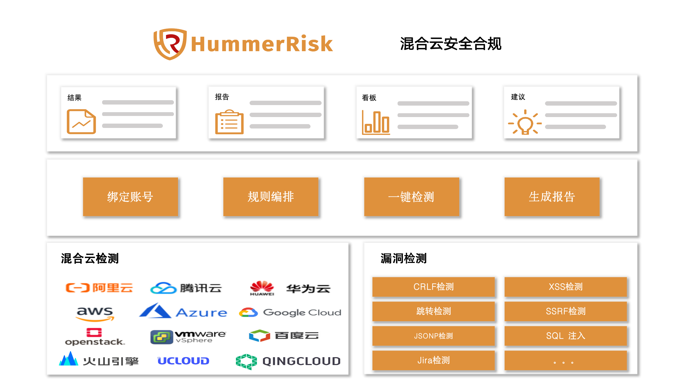
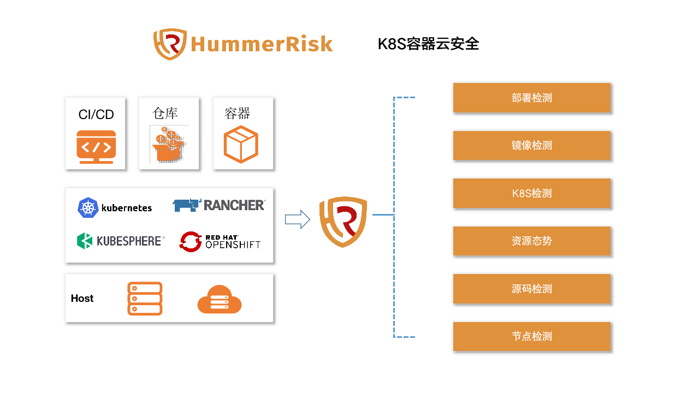
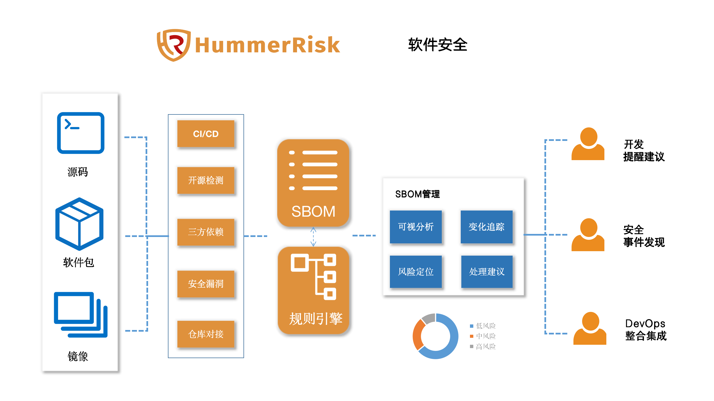

<p align="center">
    <a href="https://docs.hummerrisk.com">
        
    </a>
</p>
<h3 align="center">
    云原生安全检测平台 
    <a href="https://github.com/hummerrisk/hummerrisk/blob/master/README_EN.md" style="color: #df913c;">[英文版]</a>
</h3>

<p align="center">
    <a href="https://www.codacy.com/gh/hummerrisk/hummerrisk/dashboardutm_source=github.com&amp;utm_medium=referral&amp;utm_content=hummerrisk/hummerrisk&amp;utm_campaign=Badge_Grade"></a>
    <a href="https://www.gnu.org/licenses/old-licenses/gpl-3.0"></a>
    <a href="https://github.com/hummerrisk/hummerrisk/releases/latest"></a>
    <a href="https://github.com/hummerrisk/hummerrisk"></a>
    <a href="https://github.com/hummerrisk/hummerrisk/releases"></a>
</p>
<hr/>

## HummerRisk 是什么

> HummerRisk 是开源的云原生安全平台，以非侵入的方式对云原生环境进行全面安全检测。我们核心解决三个方面的问题，底层的混合云安全合规，中层的K8S容器云安全和上层的软件安全。



## HummerRisk 能做什么

### **混合云安全**
* 混合云安全合规检测：
  对主流的公(私)有云资源进行安全合规检测，例如等保2.0预检、CIS 合规检查、各种基线检测，同时可自定义检测规则；
* 漏洞检测：
  基于漏洞规则库，通过扫描等手段对指定的网络设备及应用服务的安全脆弱性进行检测；
* 合规报告：
  一键获取合规报告，全面掌控安全态势。

  

>**优势是什么？**  
> * 支持全面: 支持的几乎所有公有云,包括：阿里云、腾讯云、华为云、火山引擎、百度云、青云、UCloud、Amazon Web Services、Microsoft Azure、Google Cloud，支持的私有云包括：OpenStack、VMware vSphere，并还在不断的扩充支持的范围；
> * 容易上手: 只需绑定云账号，就可以一键执行检测；
> * 开箱即用: 内置大量规则，并可按需自定义规则。


### **K8S 容器云安全**
* K8S 资源态势：
  可以关联多个 K8S 集群，统一查看各个关联环境的资源态势；
* 环境检测：
  根据 K8S 安全基线进行检测，发现存在的配置错误、安全漏洞、危险动作等内容；
* 镜像检测：
  全面检测镜像相关的漏洞，包括操作系统、软件包、应用程序依赖等方面；
* 容器检测：
  对运行容器进行扫描检测，发现存在的安全问题和风险内容；
* 部署检测：
  检测 K8S 的部署编排文件，在部署前发现其中的配置问题；
* 主机检测：
  可以自定义检测内容，发现底层主机/虚机中存在问题。

  


>**优势是什么？**
> * 兼容性: 支持多种 K8S 发行版；
> * 独立性: 中立产品，客观检测；
> * 无侵入：无侵入式检测。

### **软件安全**

以源码、软件、镜像相结合的检测为基础，帮助企业构建和持续管理 SBOM，提升软件供应链安全、开源安全。
* 源码检测：检测开发者的源代码，提前发现其中的开源协议、依赖、漏洞、代码等问题；
* 软件依赖检测：通过对软件成分的分析，发现依赖漏洞，同时构建 SBOM；
* 镜像依赖检测：检测镜像中的各种依赖信息，并发现安全漏洞；
* SBOM 管理: SBOM 的可视化管理和分析，检测 SBOM 的变更，快速发现和定位软件供应链中的风险和漏洞，给出合理的处理建议。
 
  

>**优势是什么？**
> * 全生命周期: 覆盖开发、构建、运行等多个阶段、支持对接多种仓库；
> * 自动处理: SBOM 的处理和建设过程自动化完成；
> * 可视化: 为管理和分析提供了便捷的可视化界面。


## 快速开始

仅需两步快速安装 HummerRisk：

1.  准备一台不小于 4 核 8 G 内存的 64 位 Linux (建议首选 CentOS 7 以上) 主机；
2.  以 root 用户执行如下命令一键安装 HummerRisk。

```sh
curl -sSL https://github.com/HummerRisk/HummerRisk/releases/latest/download/quick_start.sh | sh
```
## 帮助文档
获取更多的产品信息和使用说明，可以访问我们的在线帮助文档
> [帮助文档](https://docs.hummercloud.com)

## 技术优势

- [x] 开源开放：HummerRisk 遵循 GPL v3 开源协议;
- [x] 无侵入式：基于无侵入式的实现方式，快速上手，降低潜在风险;
- [x] 支持全面：从底层基础环境到上层软件应用，覆盖云原生环境的全部方面;
- [x] 规则丰富：大量内置检测规则，如 CIS 规则，等保2.0 规则等，同时支持自定义规则;
- [x] 支持信创：支持在信创环境中部署。

## 微信群


## 公众号


## 安全说明

如果您在使用过程中发现任何安全问题，请通过以下方式直接联系我们：

- 邮箱：support@hummercloud.com

## 技术栈

- [Vue](https://vuejs.org/)：使用了 Vue.js 作为前端技术栈
- [Spring Boot](https://www.tutorialspoint.com/spring_boot/spring_boot_introduction.htm)：使用了 Spring Boot 作为后端技术栈
- [MySQL](https://www.mysql.com/)：使用了 MySQL 作为数据库引擎
- [Cloud Custodian](https://cloudcustodian.io/)：使用了 Cloud Custodian 作为云平台检测引擎
- [Prowler](https://prowler.pro/)：使用了 Prowler 作为 AWS 检测引擎
- [Nuclei](https://nuclei.projectdiscovery.io/)：使用了 Nuclei 作为漏洞检测引擎
- [Xray](https://xray.cool/)：使用了 Xray 作为漏洞检测引擎
- [Trivy](https://github.com/aquasecurity/trivy)：使用了 Trivy 作为云原生检测引擎
- [Dependency Check](https://jeremylong.github.io/DependencyCheck/)：使用了 Dependency Check 作为软件依赖检查引擎
- [Element](https://element.eleme.cn/#/)：使用了 Element 提供的优秀组件库

## License & Copyright

Copyright (c) 2022 瀚马科技 HummerCloud, All rights reserved.

Licensed under The GNU General Public License version 3 (GPLv3) (the "License"); you may not use this file except in compliance with the License. You may obtain a copy of the License at

https://www.gnu.org/licenses/gpl-3.0.html

Unless required by applicable law or agreed to in writing, software distributed under the License is distributed on an "AS IS" BASIS, WITHOUT WARRANTIES OR CONDITIONS OF ANY KIND, either express or implied. See the License for the specific language governing permissions and limitations under the License.
