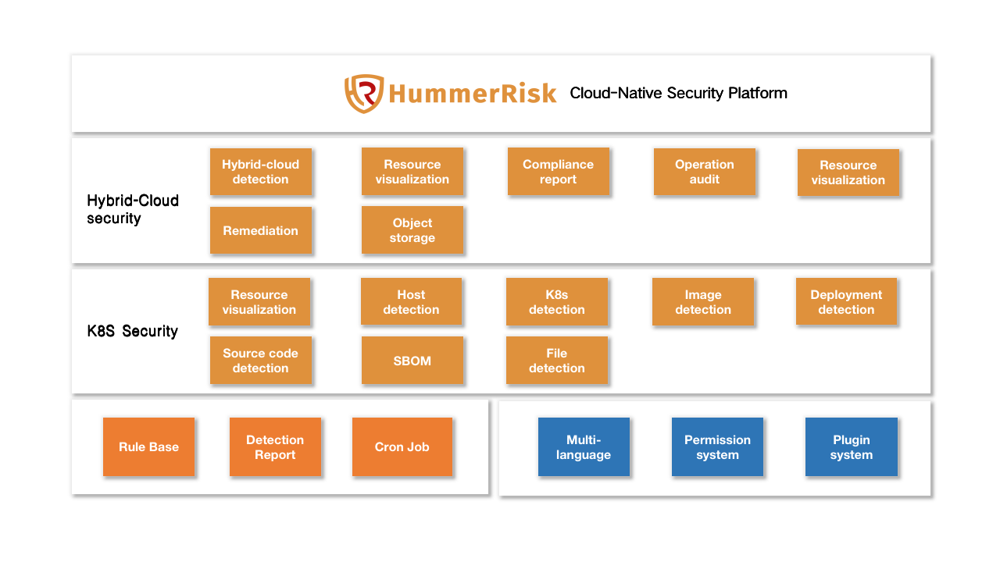
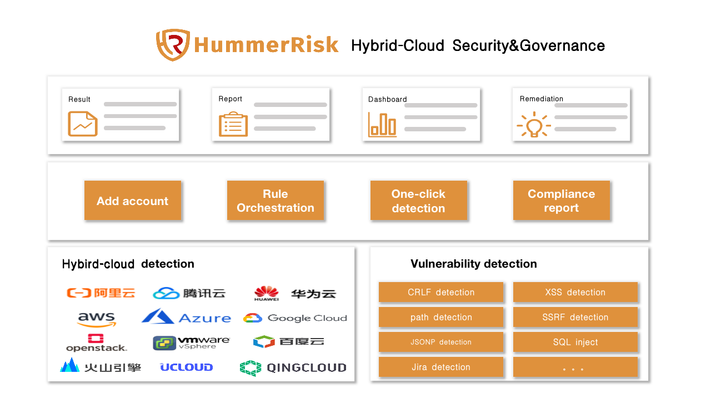
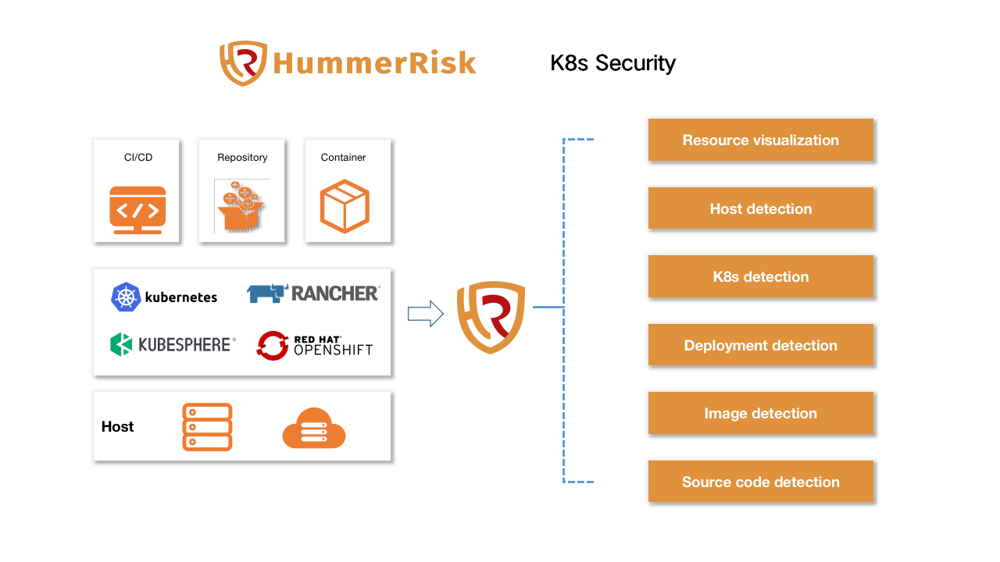
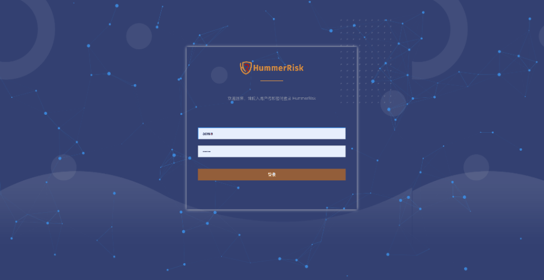

<p align="center">
    <a href="https://hummerrisk.com">
        
    </a>
</p>
<h3 align="center">
    Cloud Native Security Platform 
    <a href="https://github.com/hummerrisk/hummerrisk/blob/master/README.md" style="color: #df913c;">[中文]</a>
</h3>

<p align="center">
    <a href="https://www.codacy.com/gh/hummerrisk/hummerrisk/dashboardutm_source=github.com&amp;utm_medium=referral&amp;utm_content=hummerrisk/hummerrisk&amp;utm_campaign=Badge_Grade"></a>
    <a href="https://www.gnu.org/licenses/old-licenses/gpl-3.0"></a>
    <a href="https://github.com/hummerrisk/hummerrisk/releases/latest"></a>
    <a href="https://github.com/hummerrisk/hummerrisk"></a>
    <a href="https://github.com/hummerrisk/hummerrisk/releases"></a>
</p>
<hr/>

## Introduction

> HummerRisk is an opensource cloud-native security platform. It resolve the  cloud-native security and governance issues in agentless way. Core capabilities include hybrid-cloud security and container cloud detection.




## Features

### **Hybrid-Cloud Security & Governance**

* Hybrid-cloud compliance:  
   Continuously monitor compliance for multiple clouds with many compliance frameworks, such as Guarantee 2.0, CIS ,HPPA, and some best practice, we also support customizable rules;
* Cloud resource visualization:  
  Synchronize resources on the cloud, and quickly view various resource situations and cloud resource topology diagrams of the hybrid cloud;
* Compliance report:  
  One-click to get the compliance reports with fully vision of the security situation;
* Operation audit:  
  Unified monitoring of account activities for Hybrid-cloud environment, and auditing the operation logs of the cloud.
  

  

>**Advantage**

* Comprehensive support:   
Almost all public clouds supported, including: Alibaba Cloud, Tencent Cloud, Huawei Cloud, VolcEngine, Baidu Cloud, QingCloud, JDCloud, KSCloud, QiniuCloud, UCloud, Amazon Web Services, Microsoft Azure, Google Cloud, and supported private clouds include: OpenStack, VMware vSphere, and is still expanding the scope of support;
* Easy to use:   
Only need to add account of csp, you can perform the detection with one click;
* Flexible and convenient:   
 Analyze results in multiple dimensions, and arrange tasks according to needs;
* Out of the box:   
Large number of built-in rules, and continuously extend. Users can customize the rules as needed.


### **K8s Security**

* K8s resource situation:  
   You can associate multiple K8S clusters,then view the resource situation in a unified panel;
* Host detection:  
   You can customize the detection content to find problems in the underlying host or virtual machine;
* K8s detection:     
   According to the K8S security baseline, and found the existence of misconfiguration , vulnerabilities, dangerous actions, etc.;
* Deployment detection:  
   Detect K8S deployment orchestration files and discover configuration problems before deployment;
* Image detection:  
   Comprehensive detection vulnerabilities in image, including operating systems, software packages, application dependencies, etc.;
* Source code detection:  
   Detect the developer's source code, and discover open source protocols, dependencies vulnerabilities;
* File detection:  
   Upload specific language files or folders in source code projects, and discover application-dependent vulnerability;
* SBOM management:  
   Visual management and analysis of SBOM, manage SBOM drift, quickly discover and locate risks and vulnerabilities in the software supply chain, and give suggest remediation.

  


>**Advantage**

* Compatibility: Supports multiple K8s distributions;
* Independence: neutral product, objectively tested;
* Reliability: quick response, fast and accurate;
* Non-intrusive: no intrusive detection.

## UI



> 更多优质功能持续迭代中...

## Quick start

Only to steps to install HummerRisk：

1. Prepare a 64-bit Linux vm with at least 4 cores and 8 G memory;
2. Execute the following command as root user to install HummerRisk;

```sh
curl -sSL https://github.com/HummerRisk/HummerRisk/releases/latest/download/quick_start.sh | sh
```

## Documentation

For more product information and usage instructions, you can visit our online  documentation

> [帮助文档](https://docs.hummerrisk.com)


## Wechat


## Public Account


## Safety Instructions

If you find any security problems during use, please contact us directly through the following methods :

- Email：support@hummercloud.com

## Technology Stack

- [Vue](https://vuejs.org/)：Use vue.js as Hummer-ui
- [Spring Cloud](https://spring.io/projects/spring-cloud) Spring Cloud
- [MySQL](https://www.mysql.com/)：Database
- [Cloud Custodian](https://cloudcustodian.io/)：Cloud platform detection engine
- [Prowler](https://prowler.pro/)： AWS detection engine
- [Trivy](https://github.com/aquasecurity/trivy): k8s detection engine
- [Kube-Bench](https://github.com/aquasecurity/kube-bench): CIS Kubernetes Benchmark detection tool
- [Element](https://element.eleme.cn/#/)：Element UI

## License & Copyright

Copyright (c) 2022 瀚马科技 HummerCloud, All rights reserved.

Licensed under The GNU General Public License version 3 (GPLv3) (the "License"); you may not use this file except in compliance with the License. You may obtain a copy of the License at

https://www.gnu.org/licenses/gpl-3.0.html

Unless required by applicable law or agreed to in writing, software distributed under the License is distributed on an "AS IS" BASIS, WITHOUT WARRANTIES OR CONDITIONS OF ANY KIND, either express or implied. See the License for the specific language governing permissions and limitations under the License.
